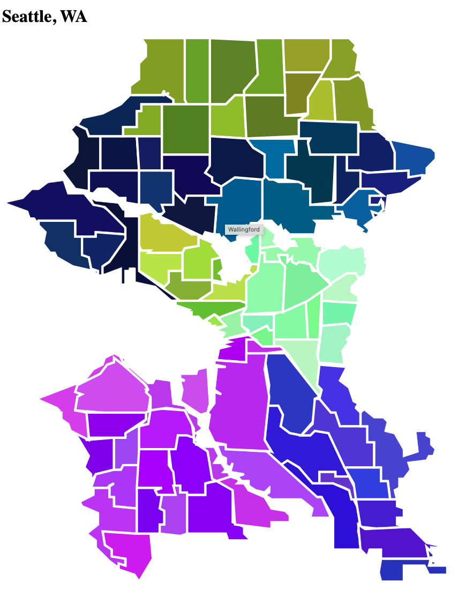

# SVG Map Generator

Generate beautiful SVG maps from GeoJSON files containing polygon data. Perfect for creating interactive maps of cities, neighborhoods, districts, and other geographic regions.


* Example of Seattle. Greatly simplified for example purposes.

## Features

-  **Convert GeoJSON to SVG**: Transform polygon-based GeoJSON files into clean, scalable SVG maps
-  **Flexible Filtering**: Filter polygons based on properties (city, region, type, etc.)
- ️ **Custom Titles**: Add custom titles to each polygon region
-  **Interactive Links**: Make regions clickable with custom href attributes
-  **Color Coding**: Assign colors based on districts, categories, or custom logic
- ️ **CLI Tool**: Easy-to-use command line interface
-  **Multiple Outputs**: Generate standalone SVG files or complete HTML pages

## Installation

### Global Installation
```bash
npm install -g .
```

### Development Setup
```bash
npm link
```

## Usage

### Basic Usage
```bash
svg-map-generator <config-file> [options]
```

Or

```bash 
npx svg-map-generator <config-file> [options]
```

Example: 
`npx svg-map-generator ./config/sample-config-new-york.js -o nyc-test-test.html`

### Options
- `-h, --help`: Show help message
- `-o, --output <file>`: Output file name (default: output.svg)
- `-v, --verbose`: Verbose output

### Examples
```bash
# Generate Seattle neighborhood map
svg-map-generator config/seattle.js -o seattle-map.html

# Generate NYC borough map as SVG
npx svg-map-generator ./config/sample-config-new-york.js -o nyc-test.html -v
```

## Configuration

### Configuration Options

#### Core Settings
- `fileName`: Path to GeoJSON file
- `city`: Display name for the map
- `scale`: Scale factor for the SVG (default: 1)
- `simplifyFactor`: Polygon simplification (0.001-0.01, lower = more detail)
- `outputType`: "svg" for standalone SVG, "html" for complete webpage

#### Custom functions (customOptions) for filtering data and adding tooltip and hyperlink functionality to SVG
- `filterCallback(feature)`: Return true to include a feature in the output
- `getMetaData(feature)`: Extract custom data from each GeoJSON feature
- `title.getTitle(metaData)`: Generate title text for each polygon
- `anchorTag.getHref(metaData)`: Generate href for clickable regions (or null)
- `assignNeighborhoodRegionColors(metaData)`: Return color/category for styling

### JavaScript Config Files 

JavaScript config files provide the most flexibility with real functions, imports, and IDE support.

#### New York City Boroughs Example

Create `config/nyc.js`:

```javascript
module.exports = {
  fileName: "./data/nyc-neighborhoods.geojson",
  city: "New York City, NY",
  scale: 1,
  simplifyFactor: 0.001,
  outputType: "svg",
  
  customOptions: {
    // Extract borough and neighborhood data
    getMetaData: (feature) => {
      const borough = feature.properties?.borough || 'Unknown';
      const neighborhoodName = feature.properties?.neighborhood || feature.properties?.name || 'Unknown';
      return {
        borough,
        neighborhoodName
      };
    }
    // Show neighborhood and borough in title
    title: {
      getTitle: (metaData) => `${metaData.neighborhoodName}, ${metaData.borough}`
    },
    
    // No links for this example
    anchorTag: {
      getHref: null
    },
    
    // Include all features
    filterCallback: (feature) => feature,
    
    // Color by borough
    assignNeighborhoodRegionColors: (metaData) => metaData.borough,
    
  }
};

```
## GeoJSON Requirements

Your GeoJSON file should contain:
- Features with `Polygon` or `MultiPolygon` geometry
- Properties containing relevant metadata (names, categories, etc.)

Example GeoJSON structure:
```json
{
  "type": "FeatureCollection",
  "features": [
    {
      "type": "Feature",
      "properties": {
        "name": "Capitol Hill",
        "city": "Seattle",
        "district": "D3"
      },
      "geometry": {
        "type": "Polygon",
        "coordinates": [[
          [-122.123, 47.456],
          [-122.124, 47.457],
          ...
        ]]
      }
    }
  ]
}
```

## Output Examples
See output folder for example outputs. HTML files can be opened in the browser to view the SVG image.

## Development

### Project Structure
```
svg-city-src/
├── cli.js              # Command line interface
├── main.js             # Core SVG generation logic
├── helpers.js          # Utility functions
├── parseData.js        # GeoJSON parsing
├── package.json        # Package configuration
└── config/             # Example config files
    ├── seattle.js
    └── nyc.js
```

### Building from Source
```bash
git clone <repository>
cd svg-map-generator/svg-city-src
npm install
```

## License

ISC License

## Contributing

1. Fork the repository
2. Create a feature branch
3. Make your changes
4. Add tests if applicable
5. Submit a pull request

## Support

For issues, questions, or feature requests, please create an issue in the repository.
